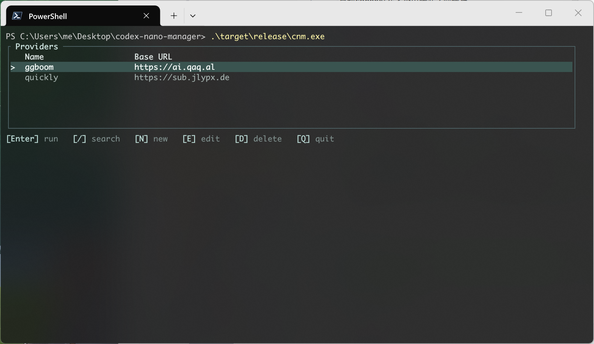
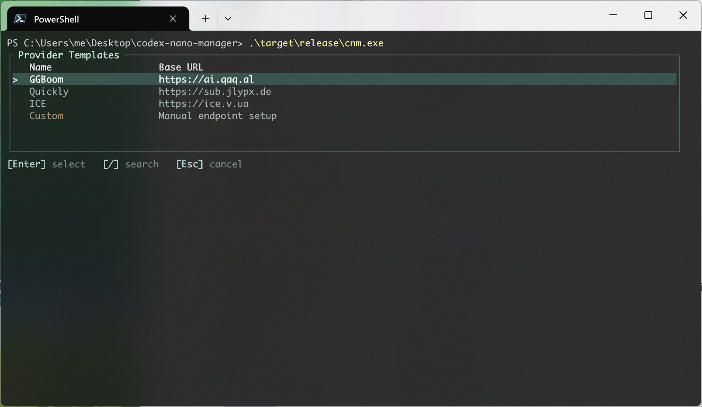
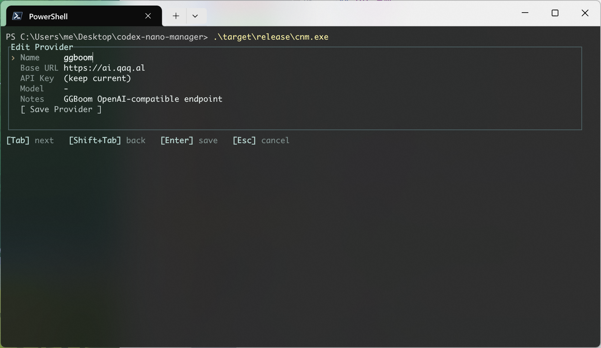

# codex-nano-manager

`codex-nano-manager` 是一个给 `codex` 用的终端管理器。它用来保存多个 OpenAI-compatible Provider 配置，在 TUI 界面里选择目标
Provider，然后带着对应的 `base_url`、API Key 环境变量和默认模型启动 `codex`。

## 项目作用

启动codex时在多个中转站之间选择
当前支持的中转 `GGBOOM`,`Ice`,`Quickly`，没有内置的也可也自定义base_url

## TUI 界面

### 主界面



### 新增 Provider / 模板选择



### 编辑 / 删除界面



## 配置文件位置

默认配置文件路径：

```text
~/.codex/codex-nano-manager/config.toml
```

## 实现原理

`cnm` 不会修改codex的配置。
codex 支持启动参数覆盖。
我们在启动时通过命令行指定 `base_url` 和 `api_key` 就可以在每次启动时指定需要的配置了，避免对codex的配置文件进行修改。

## License

本项目使用 WTFPL，见 [LICENSE](LICENSE)。
